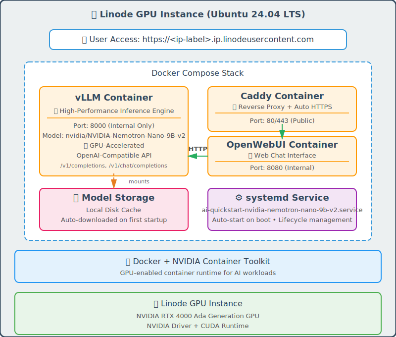

# Akamai inference Cloud - AI Quickstart NVIDIA-Nemotron-Nano-9B-v2 LLM

Automated deployment script to run your private, self-hosted LLM inference server on Akamai Cloud GPU instances. Pre-configured with NVIDIA-Nemotron-Nano-9B-v2 (9B parameter model) optimized for instruction following. Get vLLM and Open-WebUI up and running in minutes with a single command.

## About NVIDIA-Nemotron-Nano-9B-v2

**NVIDIA-Nemotron-Nano-9B-v2** is NVIDIA’s optimized ~9B-parameter LLM built for high-performance inference on NVidia GPUs including RTX ada 4000 ada. Its architecture is aggressively optimized for throughput, quantization friendliness, and low-latency deployment—the goal is to maximize performance per watt and per dollar on NVIDIA hardware.


**Key advantages:**
- **GPU-optimized architecture**: Designed and tuned by NVIDIA to take advantage of TensorRT-LLM, FP8 quantization, and accelerated KV-cache formats.
- **Memory efficient**: 9B parameters fit comfortably on a single RTX 4000 Ada GPU with room for context
- **Quantization ready (FP8, INT8, INT4)**: Maintains excellent performance even under aggressive quantization—making it suitable for edge inferencing or large-scale deployments.

-----------------------------------------
## 🚀 Quick Start

Just run this single command:

```bash
curl -fsSL https://raw.githubusercontent.com/linode/ai-quickstart-nvidia-nemotron-nano-9b-v2/main/deploy.sh | bash
```

That's it! The script will download required files and guide you through the interactive deployment process.

## ✨ Features
- Fully Automated Deployment: handles instance creation with real-time progress tracking
- Basic AI Stack: vLLM for LLM inference with pre-loaded model and Open-WebUI for chat interface
- Cross-Platform Support: Works on macOS and Windows (Git Bash/WSL)

-----------------------------------------

## 🏗️ What Gets Deployed



<br clear="left"/>

### Linode GPU Instance with
- Ubuntu 24.04 LTS with NVIDIA drivers
- Docker & NVIDIA Container Toolkit
- Systemd service for automatic startup on reboot

### Docker container
| | Service | Description | 
|:--:|:--|:--|
|  | **vLLM** | High-throughput LLM inference engine with OpenAI-compatible API (port 8000) |
|  | **Open-WebUI** | Feature-rich web interface for AI chat interactions (port 3000) |

-----------------------------------------

## 📋 Requirements

### Akamai Cloud Account
- Active Linode account with GPU access enabled

### Local System Requirements
- **Required**: bash, curl, ssh, jq
- **Note**: jq will be auto-installed if missing

-----------------------------------------
## 🚦 Getting Started

### 1. Option A: Single Command Execution

No installation required - just run:

```bash
curl -fsSL https://raw.githubusercontent.com/linode/ai-quickstart-nvidia-nemotron-nano-9b-v2/main/deploy.sh | bash
```

### 1. Option B: Download and Run

Download the script and run locally:

```bash
curl -fsSLO https://raw.githubusercontent.com/linode/ai-quickstart-nvidia-nemotron-nano-9b-v2/main/deploy.sh
bash deploy.sh
```

### 1. Option C: Clone Repository

If you prefer to inspect or customize the scripts:

```bash
git clone https://github.com/linode/ai-quickstart-nvidia-nemotron-nano-9b-v2
cd ai-quickstart-nvidia-nemotron-nano-9b-v2
./deploy.sh
```

> [!NOTE]
> if you like to add more services check out docker compose template file
> ```
> vi /template/docker-compose.yml
> ```
>

### 2. Follow Interactive Prompts
The script will ask you to:
- Choose a region (e.g., us-east, eu-west)
- Select GPU instance type
- Provide instance label
- Select or generate SSH keys
- Confirm deployment

### 3. Wait for Deployment
The script automatically:
- Creates GPU instance in your linode account
- Monitors cloud-init installation progress
- Waits for Open-WebUI health check
- Waits for vLLM model loading

### 4. Access Your Services
Once complete, you'll see:
```
🎉 Setup Complete!

✅ Your AI LLM instance is now running!

🌐 Access URLs:
   Open-WebUI:  http://<instance-ip>:3000

🔐 Access Credentials:
   SSH:   ssh -i /path/to/your/key root@<instance-ip>
```

### Configuration files in GPU Instance
```
   # Install script called by cloud-init service
   /opt/ai-quickstart-nvidia-nemotron-nano-9b-v2/install.sh

   # docker compose file calle by systemctl at startup
   /opt/ai-quickstart-nvidia-nemotron-nano-9b-v2/docker-compose.yml

   # service definition
   /etc/systemd/system/ai-quickstart-nvidia-nemotron-nano-9b-v2.service
```

-----------------------------------------

## 🗑️ Delete Instance

To delete a deployed instance:

```bash
# Remote execution
curl -fsSL https://raw.githubusercontent.com/linode/ai-quickstart-nvidia-nemotron-nano-9b-v2/main/delete.sh | bash -s -- <instance_id>

# Or download script and run
curl -fsSLO https://raw.githubusercontent.com/linode/ai-quickstart-nvidia-nemotron-nano-9b-v2/main/delete.sh
bash delete.sh <instance_id>
```

The script will show instance details and ask for confirmation before deletion.

-----------------------------------------

## 📁 Project Structure

```
ai-quickstart-nvidia-nemotron-nano-9b-v2/
├── deploy.sh                    # Main deployment script
├── delete.sh                    # Instance deletion script
├── script/
│   └── quickstart_tools.sh      # Shared functions (API, OAuth, utilities)
└── template/
    ├── cloud-init.yaml          # Cloud-init configuration
    ├── docker-compose.yml       # Docker Compose configuration
    └── install.sh               # Post-boot installation script
```

-----------------------------------------
## 🔒 Security

**⚠️ IMPORTANT**: By default, ports 3000 are exposed to the internet

### Immediate Security Steps

1. **Configure Cloud Firewall** (Recommended)
   - Create Linode Cloud Firewall
   - Restrict access to ports 3000 by source IP
   - Allow SSH (port 22) from trusted IPs only

2. **SSH Security**
   - SSH key authentication required
   - Root password provided for emergency console access only

-----------------------------------------
## 🛠️ Useful Commands

```bash
# SSH into your instance
ssh -i /path/to/your/key root@<instance-ip>

# Check container status
docker ps -a

# Check Docker containers log
cd /opt/ai-quickstart-nvidia-nemotron-nano-9b-v2 && docker compose logs -f

# Check systemd service status
systemctl status ai-quickstart-nvidia-nemotron-nano-9b-v2.service

# View systemd service logs
journalctl -u ai-quickstart-nvidia-nemotron-nano-9b-v2.service -n 100

# Check cloud-init logs
tail -f /var/log/cloud-init-output.log -n 100

# Restart all services
systemctl restart ai-quickstart-nvidia-nemotron-nano-9b-v2.service

# Check NVIDIA GPU status
nvidia-smi

# Check vLLM loaded models
curl http://localhost:8000/v1/models

# Check Open-WebUI health
curl http://localhost:3000/health

# Check vLLM container logs
docker logs vllm
```

## 🤝 Contributing

Issues and pull requests are welcome! For major changes, please open an issue first to discuss what you would like to change.

## 📄 License

This project is licensed under the Apache License 2.0.

